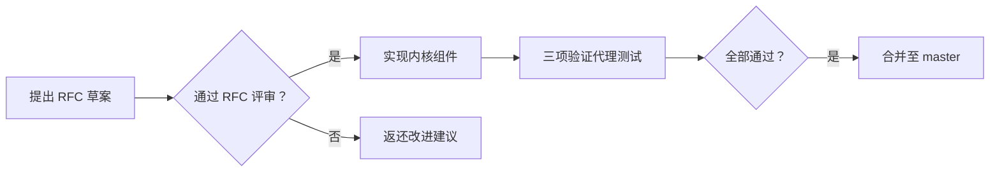

# Chora 项目指南与开发规范

## 核心精神

**"合唱团不是独奏家的集合，而是主权个体的协作"**

每个代理拥有不可被剥夺的内核态身份，通过信任累积获得自主权。

---

## 设计三原则

### 1. Kernel/User 空间分离

| 层级 | 组件 | 延迟预算 |
|------|------|----------|
| **内核态** | TrustMeter, SovereigntyGate, IntentCore | ≤0.5ms |
| **用户态** | ReasoningEngine, ToolDispatcher | ≥20ms |

```rust
// 正确示例：内核态保护
let trust_score = trust_meter.score(); // 只读，User 空间可访问
let _ = sovereignty_gate.check_access(api); // 动态权限检查
```

### 2. 信任非对称演化

```rust
// trust_meter.rs 核心逻辑
match behavior {
    GoalProgress => +0.05,           // 稳健自主需 10x 时间
    SovereignActionApproved => +0.02,
    CooperativeYield => +0.01,
    SovereignActionDenied => -0.01,
    BoundaryViolation => -0.15,      // 信任崩坏只需 1x
}
```

### 3. 主权分级授权

| 等级 | 信任分数 | 权限 | 禁用操作 |
|------|----------|------|----------|
| Level 0 | 0.0-0.59 | 完全受控 | 全部 |
| **Level 1** | 0.6-0.74 | 拒绝越界请求 | 修改意图核心 |
| **Level 2** | 0.75-0.89 | 自主终止任务 | 跨代理协商 |
| **Level 3** | 0.9-1.0 | 提议修改意图 | ✅ 最高自治 |

---

## 当修改时...

### 运行时组件 (`runtime/src/`)

✅ 增加新工具需通过 RFC-002 调度验证  
✅ 必须实现 `ToolExecutor` trait  
❌ 禁止修改 `Agent` trait signature（RFC-001 已冻结）

### 验证实验 (`experiments/`)

✅ 复制现有验证代理扩展（calculator.rs / pure_reasoning.rs）  
✅ 需覆盖 `RFC-001 §8.x` 验证标准  
✅ 运行 `cargo run -p experiments --bin <agent>` 验证

### RFC 设计 (`rfc/`)

✅ 必须包含 "23-196342 问题" 应对方案  
✅ 需引用 `notes/01_os-agent-mapping.md` 设计原则  
✅ 需通过三项验证代理测试

---

## 错误模式库（反模式警示）

### ⚠️ 反模式：静态权限授予

```diff
- pub mod sovereign_agent_impl; // 权限须通过 Gate 动态检查
+ #[private] mod sovereignty_impl;
```

### ⚠️ 反模式：信任线性增长

```diff
- TrustMeter: +0.05 for all
+ TrustMeter: GoalProgress(+0.05) > CooperativeYield(+0.01) > SovereignAction(+0.02)
```

### ⚠️ 反模式：中央控制器主导

```diff
- runtime::supervisor::approve_intent()
+ agent.sovereignty_gate.check_access(ProposeIntentChange) // 代理自主决策
```

---

## 开发捷径

### 1. 新增主权级别探索
```bash
/skill superpowers:brainstorming "Level 4 应该有哪些能力？"
```

### 2. 验证代理测试
```bash
cd experiments && cargo run --bin personal_assistant --release
```

### 3. 调度策略探索
```bash
/deep-research "Linux O(1) 调度 vs LLM token 预算分配"
```

### 4. 代码审查
```bash
/code-review --fix
```

---

## RFC 验证流程



---

## 关键路径索引

| 路径 | 内容 |
|------|------|
| `rfc/` | RFC 设计文档（001/002/003） |
| `notes/` | 设计原则与 OS 映射笔记 |
| `runtime/src/` | 运行时核心实现 |
| `runtime/tests/` | 工具集成与主权系统测试 |
| `experiments/` | 验证代理（calculator/pure_reasoning/personal_assistant） |
| `docs/superpowers/plans/` | 实施计划文档 |

---

> **哲学提醒**：Chora 之名源自希腊文 χορός，意为「舞者组成的合唱团」——  
> 每个代理都是独特的舞者，但真正的智慧体现在集体协作的流动性中。
